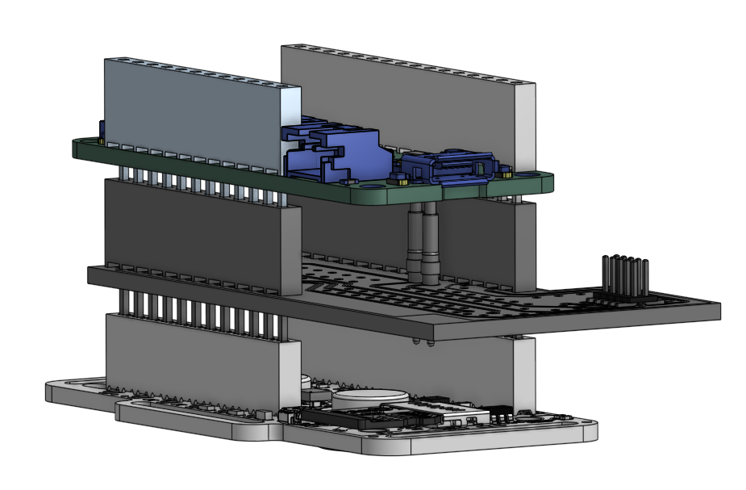
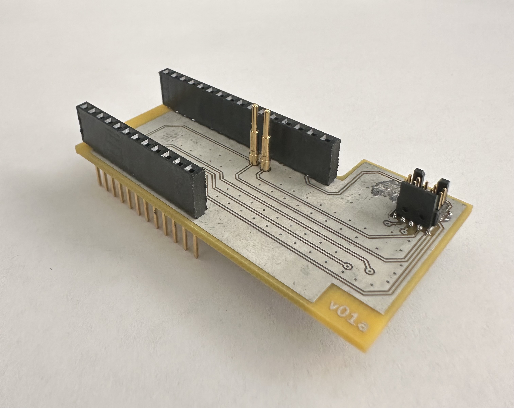

# Description
- This is a SWD breakout shield for the Feather M0 and a JTAG breakout shield for Feather ESP32.
- The Feather M0 has a provision for SWD debugging which requires soldering leads to the SWD pads on the bottom on the Feather M0. We made this shield so that we can debug a Feather M0 without having to solder leads. Instead, we use pogo pins to create the contact when the feather M0 is stacked on this shield.
- The Feather ESP32 can be debugged using the JTAG interface. This shield has a provision for debugging with ESP32 using solder bridges to create the necessary connections. **This configuration has not been tested.**

## Debug shield
**Note that this is a bare bones board (which is why the SM and silk screen are missing)**

| stage | how it looks |
|-------|----------|
| After fabrication |  |
| After Assembly |  |
| Stacked with a Feather |  |
| Stacked with Feather and [EmotiBit](https://www.emotibit.com/) |  |

# Using this repository
- The latest release contains all files required for creating the board.
- To fabricate this board
  - Download the `.zip` from the release page.
  - The files needed for manufacturing are in the `Gerbers` folder.
  - Just upload the gerber design files on a manufacturer's website and choose other board specifications.
  - We used [`4PCB`](https://www.4pcb.com/pcb-prototype-2-4-layer-boards-specials.html) as our manufacturer.
  - The `_bom.csv` file contains the parts needed for assembly. You can directly upload the bom file into the digikey portal to get the required parts for assembly.
- Once the shield is fabbed and stacked, you can use the 10 pin JTAG conector to connecto to a [J-Link debugger](https://www.segger.com/products/debug-probes/j-link/).

## Assembly notes
- It is important to line up the pogo pins vertically to ensure there is a contact with the pads on the Feather. The following sequence helps with the allignment:
  - solder the 12 and 16 pin connector.
  - place the pogo pins in the correct position
  - stack the Feather on the shield.
  - then align the pogo pins with a pair of tweezers to ensure contact.
  - solder the pins in place
- We used stacking headers because we intend to use this as a triple stack with EmotiBit, but if you are only interested in debugging the Feather, then you can use normal female socket for the connector. 

# Additional Notes
- The design was created in Kicad 7.
- If you want to build on top of this design, please feel free to fork the repository and make the rewuired changes! you will need to download Kicad v7+ to work with the design files.
